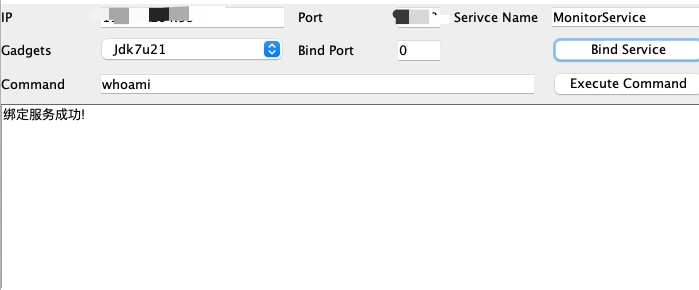
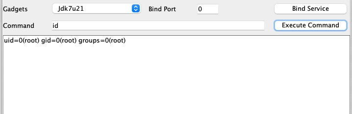

# attackRmi

利用lookup registry触发的反序列，比起bind能多打一些版本，无需出网无需落地文件。
目前只支持了CommonsCollections、CommonsBeanutils、Jdk7u21利用链，后续再更新利用链和看看是否要支持绕JEP290的那些方法。

众所周知，RMI服务客户端服务端可以双向攻击，为了解决这个问题，工具里没有依赖CommonsCollections、CommoneBeanutils包，把一些核心类给抽取了出来并且改了一些反序列化所需要的方法。

## 使用方法

如果无安全组特其他策略时，只需要修改IP、Port即可。
先绑定服务，再执行命令。
当Gadgets选择Auto时，会尝试所有利用链绑定服务。

## 申明

本程序应仅用于授权的安全测试与研究目的
